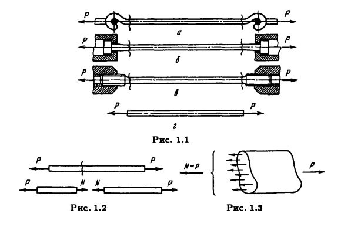
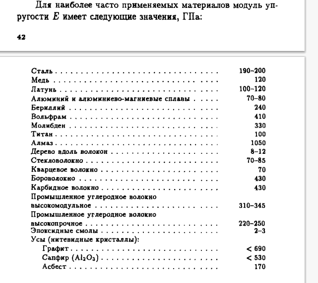
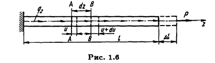
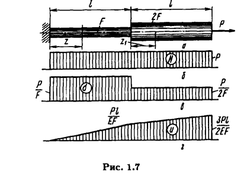
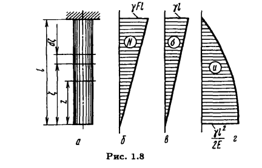
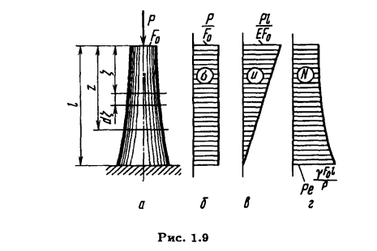
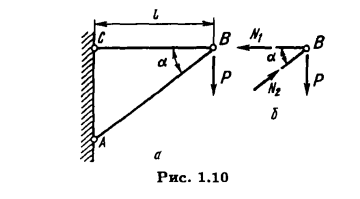
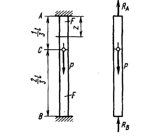
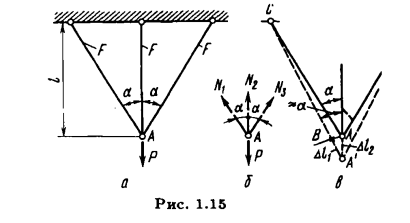
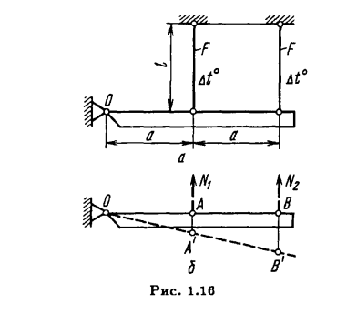

## РАСТЯЖЕНИЕ И СЖАТИЕ

(ff37)

При растяжении нормальная сила N направлена от сечения, а при сжатии к сечению.

Для однородного стержня:

##### Определение напряжения $\sigma = \displaystyle\frac{N}{F} - F $ площадь поперечного сечения. $(B1.1)$

#### Принцип Сен-Венана

Особенности приложения внешних сил к растянутому стержню проявляют­ся, как правило, на расстояниях, не превышающих характер­ных размеров поперечного сечения стержня.

### Удлинения стержня и закон Гука. Уравнения равновесия

##### Относительное удлинение стержня $\varepsilon = \displaystyle\frac{\Delta l}{l}$ $(B1.3)$

##### Относительное удлинение элемента: $\varepsilon = \displaystyle\frac{u+du-u}{dz} = \frac{du}{dz} $ $(B1.3)$

##### Закона Гука: $\sigma = E \varepsilon$ - E модуль упругости первого рода.

$\sigma = E \varepsilon$ <> $\sigma = \displaystyle\frac{N}{F}$ <> $\varepsilon = \displaystyle\frac{du}{dz}$
$\downdownarrows$

$\displaystyle\frac{du}{dz} - \frac{N}{EF} = 0$ $(B1.5)$

$u(z) = \int\frac{N(z)}{EF(z)}dz$ $(B1.5.1)$

##### Система уравнений сил для всех k координат $\{_k |-q_{z_k} =  \displaystyle{\frac{dQ_{z_k}}{ds}}$ $(B9)$
$\downdownarrows Q_z = N, Q_y = 0, Q_x = 0, s \thickapprox z $ для чистого растяжения

$\displaystyle\frac{dN}{dz} + q(z) = 0$ $(B1.6)$

##### Система уравнений для чистого растяжения $(B1.5)$ $(B1.6)$ 
(ff44)
##### Растяжение стержня (инт) : $\Delta l = \displaystyle\int\limits_0^l du = \int\limits_0^l \frac{N(z)}{F(z)E} dz$

$\downdownarrows (N, F) const(z) $ для цилиндрического стержня

##### Растяжение стержня (const) : $\Delta =\displaystyle \frac{Nl}{FE}$

#####  Температурная деформация + силовая (лок) : $\varepsilon = \displaystyle\frac{\sigma}{E} + \alpha t$ 

#####  Температурная деформация (глоб) : $\Delta = \displaystyle\frac{Pl}{EF} + \alpha tl$

###### П р и м е р 1.1

Дано:
$P=50кН=50\ast10^3Н$
$F=2см^2=2\ast10^{-4}м$
$l=1м$
$Материал - сталь => E = 200\ast10^9Па$

$\sigma_{max}$ - ?
$N(z)$ - ?
$\sigma(z)$ - ?
$u(z)$ - ?

Ответ:
$N(z) = P$ - т.к. приложена в точке конца стержня
$\sigma(z) = \displaystyle\frac{N(z)}{F(z)} => \sigma(z) = \displaystyle\frac{P}{F} => \sigma(z) = \begin{dcases}
\footnotesize\frac{50\ast10^3Н}{2\ast10^{-4}}=\text{250 МПа if z} \in [0,l]\\
\footnotesize\frac{50\ast10^3Н}{4\ast10^{-4}}=\text{125 МПа if z} \in [l,2l]
\end{dcases} => \sigma_{max} = \text{250 МПа} $

$\displaystyle\frac{du}{dz} - \frac{N(z)}{EF(z)} = 0$
$\downdownarrows F,N const(z) $

$u(z) = \footnotesize\int\frac{N(z)}{EF(z)}dz = \begin{dcases}
\frac{P}{EF}|_0^z = \frac{P}{EF}z, \text{if z} \in [0,l]\\
\frac{P}{E2F}|_l^z + \frac{Pl}{EF} = \frac{P}{E2F}(z-l) + \frac{Pl}{EF}, \text{if z} \in [l,2l]
\end{dcases}$
$u(l) = \displaystyle\frac{Pl}{EF} $

$u(2l) = \displaystyle\frac{3Pl}{2EF} = \frac{3\ast50\ast10^3Н\ast1м}{2\ast200\ast10^9Па\ast2\ast10^{-4}м}=
\frac{150}{800}\ast10^{-2}м=0,1875\ast10^{-2}м=1,875мм$

###### П р и м е р 1.2

Дано:
Свободно висящий стержень
$l$ - длинна
$\gamma$ - плотность
$F$ - сечение

$N(z)$ - ?
$\sigma(z)$ - ?
$u(z)$ - ?

$N(z)=\gamma F z$
$\sigma(z) = \displaystyle\frac{N(z)}{F(z)}= \gamma z$

$u(z) = - \displaystyle\int\frac{N(z)}{EF(z)}dz = - \int\frac{\gamma F z}{EF}dz = -\frac{\gamma}{E}\int zdz = - \frac{\gamma}{E} \frac{z^2}{2}|_0^z + C$  
$\downdownarrows \text{if u(l)=0} => \frac{\gamma l^2}{2E} = C $

$u(z) = \displaystyle\frac{\gamma}{E} \frac{l^2-z^2}{2}$
$u_{max} = u(0) = \displaystyle\frac{\gamma}{E} \frac{l^2}{2}$

###### П р и м е р 1.3
(ff47)

Дано:
Свободно стоящий стержень
$l$ - длинна
$\gamma$ - плотность
$F_0$ - верхнее сечение
Условие:
$\sigma(z) = \frac{P}{F_0}$ - условие равнопрочность
Найти $F(z)$

Решение:

$\sigma(z) = \displaystyle\frac{N(z)}{F(z)}$
$\downdownarrows \sigma(z) = \frac{P}{F_0} $

$ F(z) = \frac{F_0}{P}N(z)$
$\downdownarrows N(z) = P + \gamma\int_0^z F(\zeta)d\zeta $

$F(z) = \frac{F_0}{P}(P + \gamma\int_0^z F(\zeta)d\zeta) = F_0 + \frac{F_0 \gamma}{P}\int_0^z F(\zeta)d\zeta $
$\downdownarrows \frac{d}{dz}$

$\frac{dF}{dz} = \frac{F_0 \gamma}{P}F$
$\downdownarrows \int_z$

$z=\frac{P}{F_0 \gamma}(\ln {F} - \ln {C})$
$\downdownarrows \exp(\ln A) = A$

$ C \exp(z\frac{F_0 \gamma}{P}) = F(z)$
$\downdownarrows F(0)= F_0 => C = F_0$

$F(z) = F_0\exp(z\frac{F_0 \gamma}{P})$

###### П р и м е р 1.4

Дано:

$l$
$P$

Условия:
- минимальный вес
- $\sigma = \sigma_{AB} = \sigma_{CB}$

Решение:

$\sigma(z) = \displaystyle\frac{N(z)}{F(z)}$
$\downdownarrows N_2 =  \displaystyle\frac{P}{\sin \alpha}, N_1 = \displaystyle{P\ctg\alpha}, \frac{N_1}{F_1}=\frac{N_2}{F_2} = \sigma  $

$F_1=\displaystyle\frac{P}{\sigma}\ctg\alpha, F_2=\displaystyle\frac{P}{\sigma \sin \alpha}$
$\downdownarrows\displaystyle l_1=l, l_2= \frac{l}{\cos\alpha}, V_{AB,BC}= l_1 F_1 + l_2 F_2$

$V_{AB,BC}(\alpha) = \displaystyle\frac{Pl}{\sigma}(\ctg\alpha + \frac{1}{\cos\alpha \sin\alpha})$
$V_{AB,BC}(55^{\circ})$

### Статически определимые и статически неопределимые стержневые системы

$\Delta =\displaystyle \frac{Nl}{FE}$

###### П р и м е р 1.5

$R_A+R_B=P$ - уравнение арвновесия жесткого стержня

$R_A - ?$
$R_B - ?$

Одно уравнение и два неизвестных - задача один раз статически неопределима

$\Delta_{AC} = \Delta_{BC}$ - условие расятжения при фиксированных концах в заделках
$\downdownarrows\displaystyle \Delta_{AC} = \frac{R_{A}l}{3FE}, \Delta_{BC = }\frac{2R_{B}l}{3FE}$

$R_{A}=2R_{B}$

###### П р и м е р 1.5

$N_1=N_3, 2N_1\cos\alpha+N_2=P$ - один раз неопределенность (*)

$\Delta l_1=\Delta l_2 \cos\alpha , l_1 = \frac{l}{\cos\alpha} , l_2=l$
$\downdownarrows\displaystyle \Delta l_k = \frac{N_k l_k}{EF}$
$\downdownarrows\displaystyle \Delta l_1= \frac{N_1 l}{EF\cos\alpha},\Delta l_2 = \frac{N_2 l}{EF}$

$N_1=N_2\cos^2\alpha$
$\downdownarrows\displaystyle (*)$

$\displaystyle N_1=N_3=\frac{P \cos^2\alpha}{(1+2\cos^3\alpha)}$

$\displaystyle N_2=\frac{P}{(1+2\cos^3\alpha)}$

###### П р и м е р 1.6
(ff55)

Сумма моментов:

$N_1 a +2 N_2 a = 0$

$ \Delta l_2 = 2\Delta l_1$

$\Delta= $