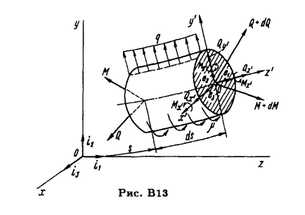
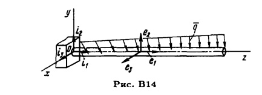
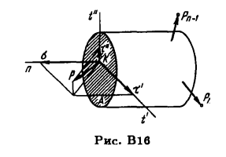
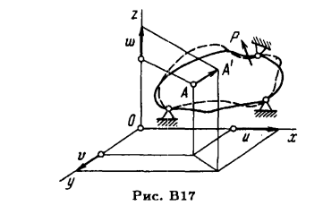
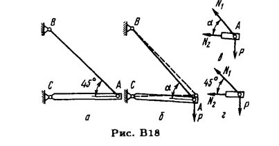
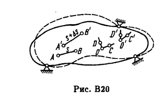

$\vec{a} = \sum_{i=1}^{3} a_{z_k}\vec{i_k} = \{a_{z_k}\vec{i_k}\}_k$

#### Скалярное произведение векторов

$(\vec{a},\vec{b}) = (\{a_{z_k}\vec{i_k}\}_k,\{b_{z_k}\vec{i_k}\}_k) $
$\downdownarrows (\vec{i_k},\vec{i_k}) \equiv 1 $
$(\vec{a},\vec{b}) = \{a_{z_k}b_{z_k}(\vec{i_k},\vec{i_k})\}_k$
$\downdownarrows$
$(\vec{a},\vec{b}) = \{a_{z_k}b_{z_k}\}_k$

#### Векторное произведение векторов

$[\vec{a}\times\vec{b}] = \begin{pmatrix}
\vec{i_1} & \vec{i_2} & \vec{i_3} \\
a_z & a_y & a_x \\
b_z & b_y & b_x \\
\end{pmatrix}$

$[\vec{a}\times\vec{b}] =\vec{i_1}\begin{pmatrix}
 a_y & a_x \\
b_y & b_x \\
\end{pmatrix} - \vec{i_2}\begin{pmatrix}
 a_z & a_x \\
b_z & b_x \\
\end{pmatrix} + \vec{i_3}\begin{pmatrix}
 a_z & a_y \\
b_z & b_y \\
\end{pmatrix}$

# Stregth_of_matherials

### Дифгеометрия стержня

Метод сечений основан на следующем принципе: если кон­струкция под действием внешних сил нахопится в равновесии, то и любая ее часть находится. в равновесии.

$Q + P = 0$ $(B1)$

$M + \mathfrak{M} = 0$ $(B2)$

(ff20)

Глобальная СК $x$, $y$, $z$
Локальная СК $x^{\prime}$, $y^{\prime}$ $z^{\prime}$

$Q=Q_{z{\prime}}e_1 + Q_{y{\prime}}e_2 + Q_{x{\prime}}e_3$ $(B3)$
$M=M_{z{\prime}}e_1 + M_{y{\prime}}e_2 + M_{x{\prime}}e_3$ $(B4)$

$Q_{z{\prime}} = N$ осевая сила направленная по касательной осевой линии

$Q_{y{\prime}}, Q_{x{\prime}}$ - nеререзывающuе силы

$M_{z{\prime}} = M_k$ - крутящий момент

$M_{y{\prime}},  M_{x{\prime}}$ - uзгuбающие моменты

$Q$ - вектор суммы внутренних сил по левому сечению
$q$ - распределенная сила вдоль стержня
$M$ - вектор суммы внутренних моментов сил по левому сечению
$(Q + dQ) - Q + qds = 0$ - относительно точки О сумма сил равна нулю
$\downdownarrows$
$\displaystyle{\frac{d\vec{Q}}{ds} + \vec{q} = 0} $ $(B5)$

$(M+dM)-M + {\mu}ds + ds [ e_1 \times (Q+dQ)]$ = 0 - относительно точки О сумма моментов сил равна нулю
$\downdownarrows$
$\displaystyle\frac{d\vec{M}}{ds} + \vec{\mu} + [ \vec{e_1} \times \vec{Q}] = 0$ $(B6)$

Вектор $q$ в декартовых координатах

$z_1 = z$
$z_2 = y$
$z_3 = x$

$\vec{q} = \sum_{i=1}^{3} q_{z_k}\vec{i_k} = \{q_{z_k}\vec{i_k}\}_k$ $(B7)$

$\vec{M} = \{M_{z_k}\vec{i_k}\}_k$ $(B8.1)$
$\vec{Q} = \{Q_{z_k}\vec{i_k}\}_k$ $(B8.2)$

$(B5)$
$\downdownarrows$

$\displaystyle{\frac{d\vec{Q}}{ds} + \vec{q} = 0} $
$\downdownarrows (B8.1)$

$\displaystyle{\frac{d{\{Q_{z_k}\vec{i_k}\}_k}}{ds}} + \{q_{z_k}\vec{i_k}\}_k = 0$ 
$\downdownarrows \forall  z_k$

##### Система уравнений сил для всех k координат $\{_k |-q_{z_k} =  \displaystyle{\frac{dQ_{z_k}}{ds}}$ $(B9)$
$(B6)$
$\downdownarrows$
$\displaystyle\frac{d\vec{M}}{ds} + \vec{\mu} + [ \vec{e_1} \times \vec{Q}] = 0$ 
$\downdownarrows e_1 \thickapprox i_1 $ $that$ $z$

$[\vec{e_1}\times\vec{Q}] = \begin{pmatrix}
\vec{i_1} & \vec{i_2} & \vec{i_3} \\
1 & 0 & 0 \\
Q_z & Q_y & Q_x \\
\end{pmatrix} = - \vec{i_2} Q_x + \vec{i_3} Q_y $

$\downdownarrows k=1 $

##### Уравнение моментов по z : $\displaystyle\frac{dM_z}{dz} + \mu_z = 0  $ $(B11.1)$

$\downdownarrows k=2 $

##### Уравнение моментов по y : $\displaystyle\frac{dM_y}{dz} + \mu_y - Q_x = 0$ $(B11.2)$

$\downdownarrows k=3 $

##### Уравнение моментов по x : $\displaystyle\frac{dM_x}{dz} + \mu_x + Q_y = 0$ $(B11.3)$

### Напряжения

##### Определение напряжения :  $\displaystyle\lim\limits_{\Delta F \to 0} \frac{\Delta\vec{ Q}}{\Delta F} = \vec{p}$

$\sigma = p_z$
$? \tau_y = p_y $
$? \tau_x = p_x$

### Перемещения и деформации

##### Определение лнейной деформации : $\displaystyle\lim\limits_{s \to 0} \frac{\Delta \vec{s}}{s} = \vec{\varepsilon}_{AB}$ - линейная деформация

##### Определение напряжения угол сдвига в точке О в плоскости COD :  $\large\gamma_{COD} = \displaystyle\lim\limits_{OC \to 0 OD \to 0} (\widehat{COD} - \widehat{C^{\prime}O^{\prime}D^{\prime}})$ 

Деформационное состояние - $\gamma $ и $\varepsilon$ - 6 чисел

### Закон Гука и принцип независимости деиствия сил (ff30)

(ff30)
$u_A = \delta_x P $ $(B12)$
$P$ сила, $u_A$ - перемещение, $\delta_x$ - коэффициент пропорциональности между силой и перемещением

#### Принцип независимости действия сuл
$u_{A_1} = \delta_{x_1} P_1 $ от $P_1$
$u_{A_2} = \delta_{x_2} P_2 $ от $P_2$

$u_{A} = \delta_{x_1} P_1 + \delta_{x_2} P_2 $ от совместного действия $P_1$ $P_2$

## РАСТЯЖЕНИЕ И СЖАТИЕ

(ff37)

При растяжении нормальная сила N направлена от сечения, а при сжатии к сечению.

Для однородного стержня:

##### Определение напряжения $\sigma = \displaystyle\frac{N}{F} - F $ площадь поперечного сечения. $(B1.1)$

#### Принцип Сен-Венана

Особенности приложения внешних сил к растянутому стержню проявляют­ся, как правило, на расстояниях, не превышающих характер­ных размеров поперечного сечения стержня.

### Удлинения стержня и закон Гука. Уравнения равновесия

##### Относительное удлинение стержня $\varepsilon = \displaystyle\frac{\Delta l}{l}$ $(B1.3)$

##### Относительное удлинение элемента: $\varepsilon = \displaystyle\frac{u+du-u}{dz} = \frac{du}{dz} $ $(B1.3)$

##### Закона Гука: $\sigma = E \varepsilon$ - E модуль упругости первого рода.

$\sigma = E \varepsilon$ <> $\sigma = \displaystyle\frac{N}{F}$ <> $\varepsilon = \displaystyle\frac{du}{dz}$
$\downdownarrows$

$\displaystyle\frac{du}{dz} - \frac{N}{EF} = 0$ $(B1.5)$

$u(z) = \int\frac{N(z)}{EF(z)}dz$ $(B1.5.1)$

##### Система уравнений сил для всех k координат $\{_k |-q_{z_k} =  \displaystyle{\frac{dQ_{z_k}}{ds}}$ $(B9)$
$\downdownarrows Q_z = N, Q_y = 0, Q_x = 0, s \thickapprox z $ для чистого растяжения

$\displaystyle\frac{dN}{dz} + q(z) = 0$ $(B1.6)$

##### Система уравнений для чистого растяжения $(B1.5)$ $(B1.6)$ 
(ff44)
##### Растяжение стержня (инт) : $\Delta l = \displaystyle\int\limits_0^l du = \int\limits_0^l \frac{N(z)}{F(z)E} dz$

$\downdownarrows (N, F) const(z) $ для цилиндрического стержня

##### Растяжение стержня (const) : $\Delta =\displaystyle \frac{Nl}{FE}$

#####  Температурная деформация + силовая (лок) : $\varepsilon = \displaystyle\frac{\sigma}{E} + \alpha t$ 

#####  Температурная деформация (глоб) : $\Delta = \displaystyle\frac{Pl}{EF} + \alpha tl$

###### П р и м е р 1.1

Дано:
$P=50кН=50\ast10^3Н$
$F=2см^2=2\ast10^{-4}м$
$l=1м$
$Материал - сталь => E = 200\ast10^9Па$

$\sigma_{max}$ - ?
$N(z)$ - ?
$\sigma(z)$ - ?
$u(z)$ - ?

Ответ:
$N(z) = P$ - т.к. приложена в точке конца стержня
$\sigma(z) = \displaystyle\frac{N(z)}{F(z)} => \sigma(z) = \displaystyle\frac{P}{F} => \sigma(z) = \begin{dcases}
\footnotesize\frac{50\ast10^3Н}{2\ast10^{-4}}=\text{250 МПа if z} \in [0,l]\\
\footnotesize\frac{50\ast10^3Н}{4\ast10^{-4}}=\text{125 МПа if z} \in [l,2l]
\end{dcases} => \sigma_{max} = \text{250 МПа} $

$\displaystyle\frac{du}{dz} - \frac{N(z)}{EF(z)} = 0$
$\downdownarrows F,N const(z) $

$u(z) = \footnotesize\int\frac{N(z)}{EF(z)}dz = \begin{dcases}
\frac{P}{EF}|_0^z = \frac{P}{EF}z, \text{if z} \in [0,l]\\
\frac{P}{E2F}|_l^z + \frac{Pl}{EF} = \frac{P}{E2F}(z-l) + \frac{Pl}{EF}, \text{if z} \in [l,2l]
\end{dcases}$
$u(l) = \displaystyle\frac{Pl}{EF} $

$u(2l) = \displaystyle\frac{3Pl}{2EF} = \frac{3\ast50\ast10^3Н\ast1м}{2\ast200\ast10^9Па\ast2\ast10^{-4}м}=
\frac{150}{800}\ast10^{-2}м=0,1875\ast10^{-2}м=1,875мм$

###### П р и м е р 1.2

Дано:
Свободно висящий стержень
$l$ - длинна
$\gamma$ - плотность
$F$ - сечение

$N(z)$ - ?
$\sigma(z)$ - ?
$u(z)$ - ?

$N(z)=\gamma F z$
$\sigma(z) = \displaystyle\frac{N(z)}{F(z)}= \gamma z$

$u(z) = - \displaystyle\int\frac{N(z)}{EF(z)}dz = - \int\frac{\gamma F z}{EF}dz = -\frac{\gamma}{E}\int zdz = - \frac{\gamma}{E} \frac{z^2}{2}|_0^z + C$  
$\downdownarrows \text{if u(l)=0} => \frac{\gamma l^2}{2E} = C $

$u(z) = \displaystyle\frac{\gamma}{E} \frac{l^2-z^2}{2}$
