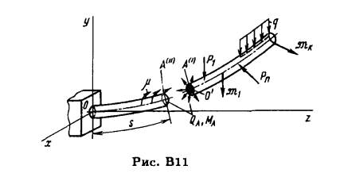
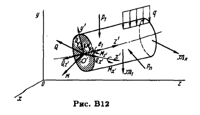

Метод сечений основан на следующем принципе: если кон­
струкция под действием внешних сил нахопится в равновесии,
то и любая ее часть находится. в равновесии.

$Q + P = 0$ $(B1)$

$M + \mathfrak{M} = 0$ $(B2)$

(ff20)

Глобальная СК $x$, $y$, $z$
Локальная СК $x^{\prime}$, $y^{\prime}$ $z^{\prime}$

$Q=Q_{z{\prime}}e_1 + Q_{y{\prime}}e_2 + Q_{x{\prime}}e_3$ $(B3)$
$M=M_{z{\prime}}e_1 + M_{y{\prime}}e_2 + M_{x{\prime}}e_3$ $(B4)$

$Q_{z{\prime}} = N$ осевая сила направленная по касательной осевой линии

$Q_{y{\prime}}, Q_{x{\prime}}$ - nеререзывающuе силы

$M_{z{\prime}} = M_k$ - крутящий момент
