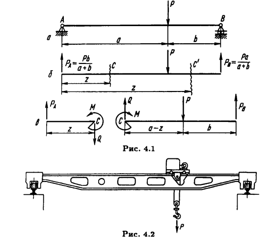
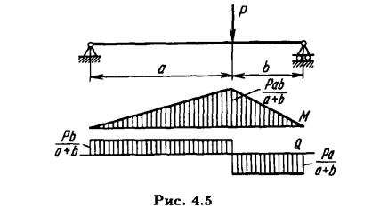
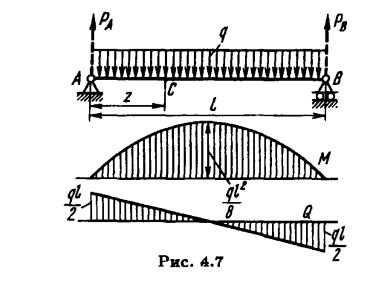
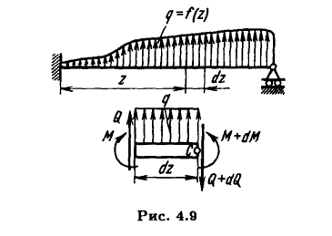
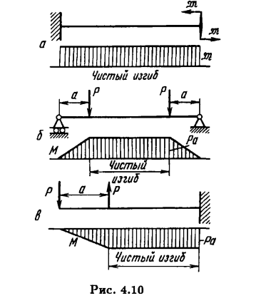
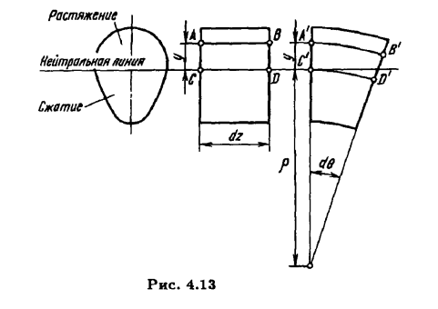
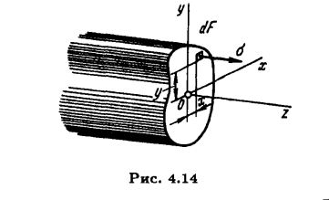
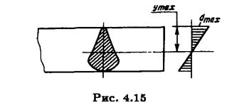

## ИЗГИБ СТЕРЖНЕЙ

(ff157)

### Внутренние силовые факторы, возникающие в поперечных сечениях стержня при изгибе

###### П р и м е р : Двухопорный стержень с единственной силой

Уравнения моментов:
$ \text {Oтносительно A} : P_A\ast L_{AA} +P_B\ast L_{AB} + P \ast L_{AP} =^{mast} 0 $
$\downdownarrows L_{AA}=0,  L_{AB}=(a+b), L_{AP}=a$
$\displaystyle P_B=\frac{Pa}{(a+b)}, P_A=\frac{Pb}{(a+b)}$

$Q(z)=\displaystyle\begin{dcases}
\frac{Pb}{(a+b)}, z \in [0,a] \\
\frac{Pa}{(a+b)}, z \in [a,a + b]
\end{dcases}$

$M_A(z)=\displaystyle\begin{dcases}
Qz=\frac{Pb}{(a+b)}z, z \in [0,a] \\
-Qz+Pa=-\frac{Pa}{(a+b)}z + Pa=\frac{Pa}{(a+b)}((a+b)-z), z \in [a,a + b]
\end{dcases}$

###### П р и м е р : Двухопорный стержень под собственным весом

$\rho - плотность$
$F- \text{сечение стержня}$
$g - \text{ускорение свободного падения}$
$q= \rho F g =^{\text{cond task}}const$

$P_A=P_B= \displaystyle\frac{P}{2}=\frac{(\rho F g)}{2}l=\frac{ql}{2}$

$dN = - qdz , N(0)=\displaystyle\frac{ql}{2}$
$\downdownarrows$
$N(z)=q(\displaystyle\frac{l}{2} - z), z \in [0,l]$ 

$M_C= z P_A - \displaystyle \int_0^z\chi q d\chi = z\frac{ql}{2} - z^2\frac{q}{2}, M(\frac{l}{2}) = \frac{lq^2}{8}, z \in [0,l]$

### Математика изгиба

(ff164)

$\displaystyle\frac{dQ}{dz}=q$  $(B4.1.1)$
$\displaystyle\frac{dM}{dz}=Q$  $(B4.1.2)$

### Напряжения при чистом изгибе

(ff166)

Геометрия круга:

$C^{\prime}D^{\prime} = \rho d\theta$
$dz = \rho d\theta$
$\displaystyle\frac{1}{\rho} = \frac{d\theta}{dz}$

Подобие сегментов:

$\varepsilon dz = y d\theta$
$\displaystyle\varepsilon = \frac{y}{\rho}$
$\downdownarrows \sigma = E \varepsilon$

$\displaystyle\sigma = E \frac{y}{\rho}$

#### Нахождение нейтральной линии

При чистом изгибе $N=0$

$N=\displaystyle\int_F\sigma dF =\frac{E}{\rho}\int_F ydF = 0 \text{ если x через центр тяжести}$

### Напряжения при поперечном изгибе

$M_x =\displaystyle \int_F \sigma x dF= \frac{E}{\rho}\int_F y x dF =^{def-poper-izgib} 0 => J_{xy} = 0$
$M(z) =^{def-poper-izgib} M_y =\displaystyle \int_F \sigma y dF =\frac{E}{\rho(z)}\int_F y^2 dF = \frac{E}{\rho(z)} J_{x}$

$\displaystyle\frac{1}{\rho} = \frac{M}{E J_x}$
$\downdownarrows \displaystyle\sigma = E \frac{y}{\rho}$

$\displaystyle\sigma = \frac{My}{J_x}$

#### Момент сопротивления сечения

$\displaystyle\sigma_{max} = \frac{My_{max}}{J_x}$

$W_x = \displaystyle\frac{J_x}{ y_{max}}$

$\displaystyle\sigma_{max} = \frac{M}{W_x}$

(ff177)
##### П р и м е р 4.9 Составить уравнение упругой линии консоли

ff(200)
##### П р и м е р 4.10

[смещение при изгибе видео 1](https://www.youtube.com/watch?v=UGCnkXZDJB8)
