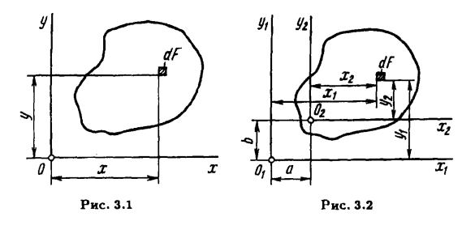
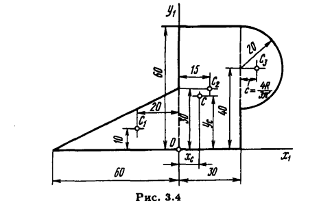
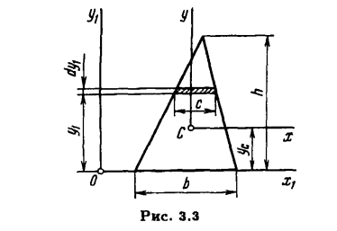
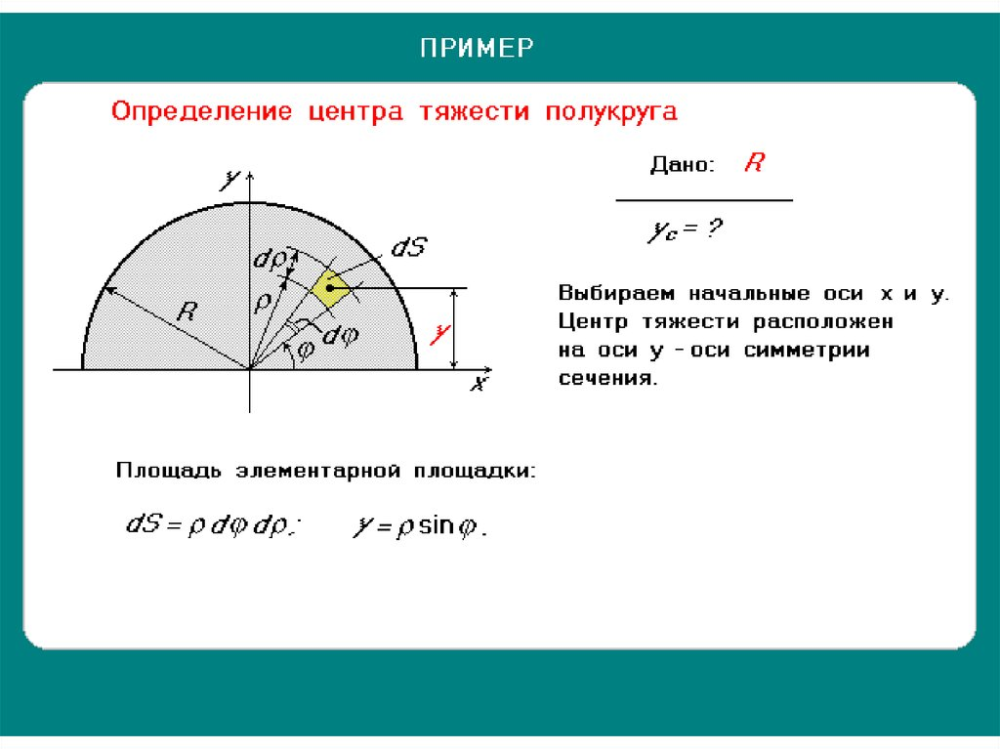
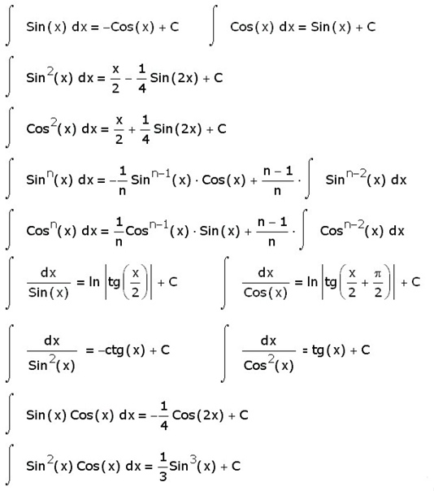
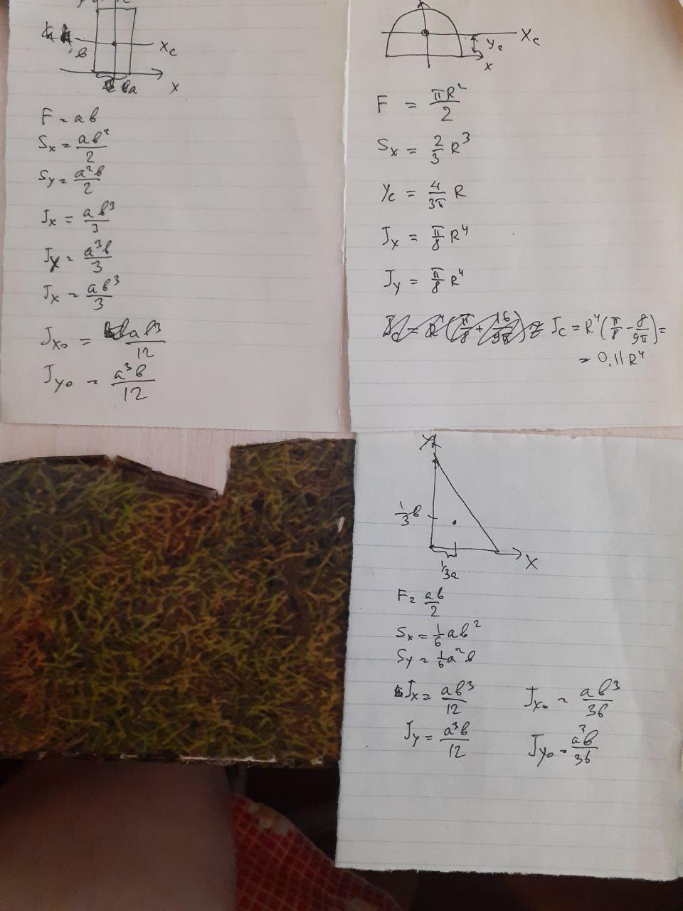

## ГЕОМЕТРИЧЕСКИЕ ХАРАКТЕРИСТИКИ ПОПЕРЕЧНЫХ СЕЧЕНИЙ СТЕРЖНЯ

### Статические моменты и моменты инерции сечения

#### Статические момент
$ S_1 = \begin{dcases}
S_{x_1} = \int_F y_1dF , \text{for axs } <x_1>\\
S_{y_1} = \int_F x_1dF , \text{for axs } <y_1>
\end{dcases}$

$\downdownarrows x_2 = x_1 - a, y_2 = y_1 - b$

$ S_2 = \begin{dcases}
S_{x_2} = \int_F y_2dF = \int_F (y_1 - b)dF = S_{x_1} - bF\\
S_{y_2} = \int_F x_2dF = \int_F (x_1 - b)dF = S_{y_1} - aF
\end{dcases}$

$\downdownarrows \text{условие положения ЦТ: } \{_i S_{k_i} = 0$

##### Координаты центра тяжести: $a_k=\displaystyle\frac{S_{x_k}}{F}$
###### Пример нахождения ЦТ сложной фигуры

#### Моменты инерции сечения

(ff146)

$J_x = \displaystyle\int_F y^2 dF$ осевой момент инерции относительно x
$J_{xy} = \displaystyle\int_F y x dF$ центробежный момент инерции
$J_y = \displaystyle\int_F x^2 dF$ осевой момент инерции относительно y

$J_{x_2} = \displaystyle \int_F (y_1 - b)^2 dF$
$J_{y_2} = \displaystyle \int_F (x_1 - a)^2 dF$
$J_{{x_2}{y_2}} = \displaystyle \int_F (x_1 - a)(y_1 - b) dF$

$J_{x_2} = J_{x_1} - 2bS_{x_1} + b^2 F$
$J_{y_2} = J_{y_1} - 2aS_{y_1} + a^2 F$
$J_{{x_2}{y_2}} = J_{{x_1}{y_1}} - bS_{x_1} - aS_{y_1} + ab F$

$ \downdownarrows\text{if x1 y1 оси центральные}$

$J_{x_2} = J_{x_1} + b^2 F$
$J_{y_2} = J_{y_1} + a^2 F$
$J_{{x_2}{y_2}} = J_{{x_1}{y_1}} + ab F$

#### Моменты сопротивления стандартных сечений
##### ЦТ треугольника

$dF = cdy_1$

$F=\displaystyle\frac{bh}{2}$

$\displaystyle\frac{c}{h-y_1}=\frac{b}{h}$
$\downdownarrows$

$c = \displaystyle\frac{b}{h}(h-y_1) = b - \frac{b}{h}y_1$

$S_x=\displaystyle\int_F y_1dF= \int_0^h y_1(b - \frac{b}{h}y_1)dy_1 = \frac{h^2b}{2} - \frac{h^3b}{3h} = \frac{b h^2}{6} $

$y_c = \displaystyle\frac{S_x}{F} = \frac{h}{3} $

$J_x=\displaystyle\int_F y_1^2dF= \int_0^h y_1^2(b - \frac{b}{h}y_1)dy_1 = \frac{h^3b}{3} - \frac{h^4b}{4h} = \frac{b h^3}{12} $

##### ЦТ полукруга

$dF = \rho d\phi d\rho $
$y=\rho\sin\phi$
$x=\rho\cos\phi$

$F=\displaystyle\int_0^R \int_0^{\pi}\rho d\phi d\rho  =\int_0^R \rho d\rho \int_0^{\pi}d\phi = \frac{\pi R^2}{2} $
$S_x=\displaystyle\int_0^R \int_0^{\pi}y\rho d\phi d\rho  =\int_0^R \rho^2 d\rho \int_0^{\pi}\sin (\phi) d\phi = \frac{2}{3}R^3$
$J_x=\displaystyle\int_0^R \int_0^{\pi}y^2\rho d\phi d\rho  =\int_0^R \rho^3 d\rho \int_0^{\pi}\sin^2 (\phi) d\phi = \frac{R^4}{4}(\frac{x}{2}-\frac{1}{4}\sin{2x})|_0^\pi = \frac{\pi}{8}R^4 $
$J_{xy}=\displaystyle\int_0^R \int_0^{\pi}yx\rho d\phi d\rho  =\int_0^R \rho^3 d\rho \int_0^{\pi}\sin (\phi) \cos(\phi)d\phi = \frac{\rho^4}{4}(-\frac{1}{4}\cos{2x})|_0^\pi = 0 $
$J_y=\displaystyle\int_0^R \int_0^{\pi}x^2\rho d\phi d\rho  =\int_0^R \rho^3 d\rho \int_0^{\pi}\cos^2 (\phi) d\phi = \frac{R^4}{4}(\frac{x}{2}+\frac{1}{4}\sin{2x})|_0^\pi = \frac{\pi}{8}R^4 $

$y_c=\displaystyle\frac{S_x}{F}=\frac{4}{3\pi}R$

##### ЦТ прямоугольника - статический момент

[Центры_моменты_элем_фиг pdf](../../img/any/Центры_моменты_элем_фиг.pdf) 
[elem.jpeg](../../img/any/elem.jpeg) 

